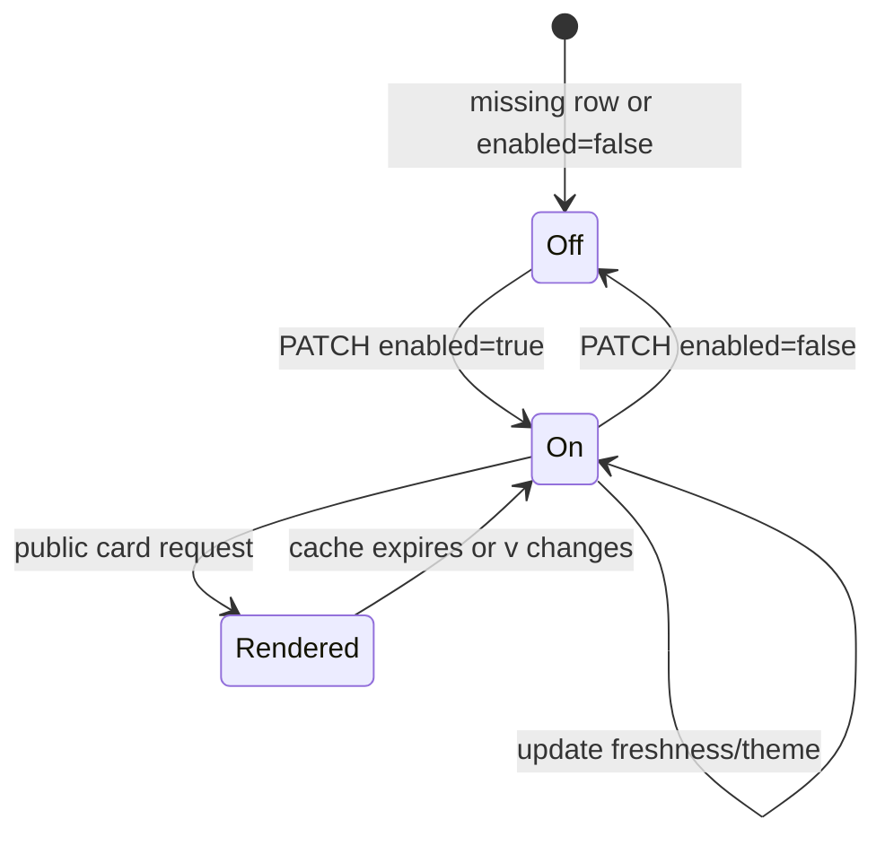

# Data Model: Embeddable Stat Cards

**Branch**: `spec/160-embeddable-cards` | **Date**: 2026-06-18

## Persisted Data

### Embed Settings

One row per user. Defaults are applied when the row is absent.

| Field | Type | Notes |
|-------|------|-------|
| `user_id` | text | Primary key; references `users.id`. |
| `enabled` | integer boolean | Default `0` (OFF). Public cards return `404` unless enabled. |
| `freshness_minutes` | integer | Default `15`; bounded by API validation. Drives `Cache-Control` and KV TTL. |
| `default_theme` | text | Styling-only preset name; defaults to `default`. |
| `created_at` | text datetime | Server timestamp. |
| `modified_at` | text datetime | Updated on every settings change. |

Rules:

- Missing settings row means `{ enabled: false, freshness_minutes: 15,
  default_theme: "default" }`.
- Visibility OFF must be evaluated before rendered-card cache lookup.
- `freshness_minutes` controls freshness only; it does not authorize or expose
  any additional data.

### Embed Template

User-supplied safe SVG template for P3 customization.

| Field | Type | Notes |
|-------|------|-------|
| `id` | text UUID | Primary key. |
| `user_id` | text | Required for all table rows; references `users.id`. |
| `name` | text | User-visible label, max 64 chars. |
| `template_svg` | text | Safe static SVG subset, max 20 KB in PR2. |
| `created_at` | text datetime | Server timestamp. |
| `modified_at` | text datetime | Updated on every template change. |

Indexes:

- `embed_templates(user_id, created_at DESC)` for list.
- Unique `(user_id, name)` is optional; PR2 may allow duplicate names because
  URLs reference `template_id`.

Validation:

- Reject malformed XML/SVG.
- Reject scripts, event-handler attributes, `foreignObject`, external
  references, remote fonts, data URLs, processing instructions, and unknown
  placeholders.
- Placeholder set is fixed in PR2 and documented from the renderer tests.
- Revalidate on render as defense in depth; a stored template that fails
  current validation is not rendered.

## Derived Data

### Embeddable Card

Not persisted. A card render is derived from:

- target user;
- card type (`heatmap`, `summary`, `languages`);
- range;
- theme;
- optional template id;
- current embed settings;
- aggregated summaries/hourly summaries plus current-day overlay.

### Rendered Card Cache Entry

Stored in KV, not D1.

| Key Part | Notes |
|----------|-------|
| `user_id` | Internal user id resolved from the public username. |
| `card_type` | `heatmap`, `summary`, or `languages`. |
| `range` | Normalized range after fallback/defaulting. |
| `theme` | Normalized theme after fallback/defaulting. |
| `template_id` | Present only when a template is used. |
| `v` | Optional caller-supplied cache-busting value. |
| `settings.modified_at` | Included or otherwise invalidates cache after OFF/theme/freshness changes. |

Value:

- SVG string.
- Render metadata such as generated time and ETag input hash.

TTL:

- `freshness_minutes * 60` seconds.
- OFF responses are not cached as images and use `Cache-Control: no-store`.

## State Transitions

## Data Access Patterns

- Public card request:
  1. Resolve `username` to `users.id` and timezone.
  2. Read embed settings or apply OFF defaults.
  3. If OFF, return `404` before KV/D1 aggregate reads.
  4. Check rate limit.
  5. Check KV rendered-card cache.
  6. On miss, read aggregates/current-day overlay and optional template.
  7. Render SVG, store in KV, return with cache headers.

- Settings request:
  - Authenticated user only; reads/writes the single settings row for
    `c.get("userId")`.

- Template request:
  - Authenticated user only; every operation includes `user_id = current user`.
  - Deletes do not need to purge all KV entries immediately if cache keys include
    template modified state; PR2 may additionally delete known keys best-effort.
